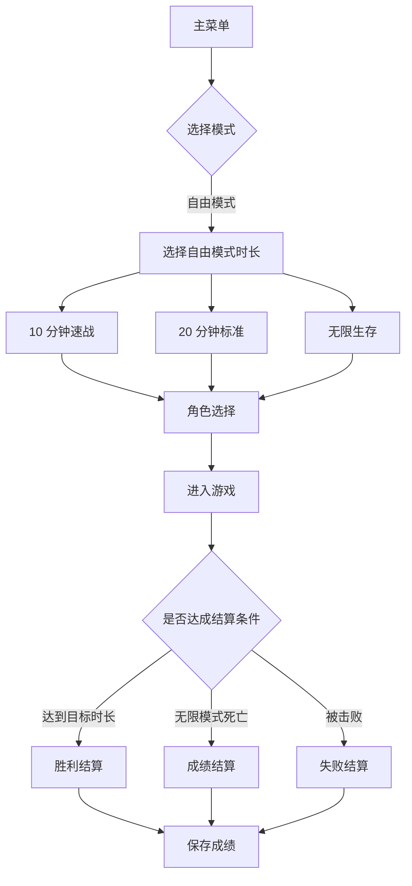
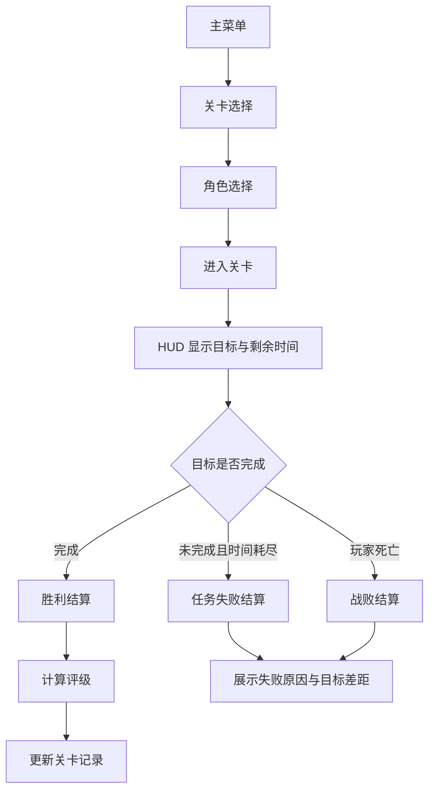
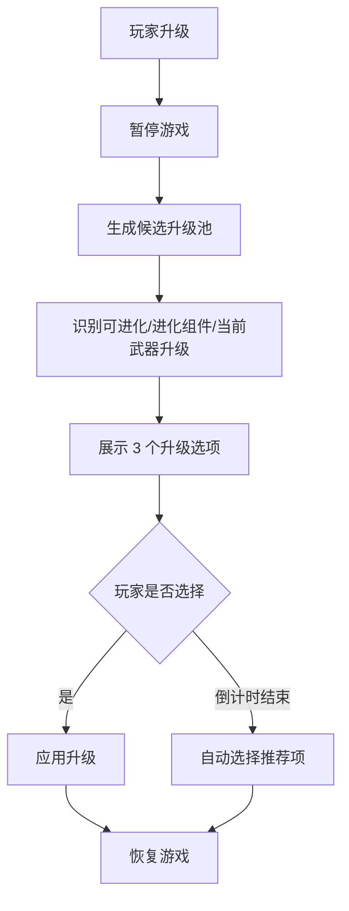

# 可玩度优化 PRD

> 文档状态：待评审
> 适用项目：幸存者传说（Survivor Legend）
> 目标版本：v0.2 可玩度优化版本
> 编写日期：2026-04-27

---

## 1. 产品概述

### 1.1 背景

当前游戏已经具备完整的类 Vampire Survivors 核心循环：角色选择、关卡模式、自由模式、自动战斗、经验升级、武器进化、宝箱奖励、Boss、角色解锁和排行榜。项目的基础可玩性已经成立，下一阶段重点应从“功能补全”转向“体验打磨”。

本 PRD 聚焦提升单局节奏、目标清晰度、升级决策、关卡变化和长期重玩动力，让玩家更容易理解目标、更愿意重复开局，并在中后期保持新鲜感。

### 1.2 产品愿景

让现有 Roguelike 生存玩法从“能玩”提升到“更容易上手、更有阶段目标、更值得反复挑战”的状态。

### 1.3 目标用户

- 新手玩家：第一次进入游戏，希望快速理解目标、操作和升级选择。
- 休闲玩家：希望能在较短时间内完成一局，并获得明确结算反馈。
- 重复游玩玩家：希望关卡、敌人和局外目标持续提供挑战与新鲜感。
- 开发/调参人员：希望需求可拆分、可验证，并能基于现有 Godot/GDScript 结构增量实现。

### 1.4 核心价值

- 降低新玩家理解成本。
- 增强每局目标感和失败复盘能力。
- 提升单局节奏选择自由度。
- 增加局内空间和敌人变化。
- 增强通关后的长期追求。

---

## 2. 当前问题与机会

### 2.1 已具备优势

- 已有主菜单、关卡选择、角色选择和结算流程。
- 已有 20 关结构、自由模式和多种胜利条件。
- 已有武器升级、属性强化和武器进化体系。
- 已有 Boss、宝箱、HUD、音频、VFX、排行榜和解锁机制。
- 核心数据集中在 `scripts/game_data.gd`，便于快速迭代数值和配置。

### 2.2 主要体验问题

| 编号 | 问题 | 影响 | 优先级 |
|------|------|------|--------|
| P-01 | 超时失败与死亡失败语义混在一起 | 玩家不清楚输在哪里，复盘困难 | P0 |
| P-02 | 自由模式默认单局时长偏长 | 休闲玩家开局门槛高，结算反馈慢 | P0 |
| P-03 | 升级选项信息不足 | 新手不知道如何选择，也不清楚进化路线 | P0 |
| P-04 | HUD 目标反馈可读性不足 | 关卡压力和剩余目标不够直观 | P1 |
| P-05 | 地图空间变化较弱 | 中后期容易只剩绕圈和数值堆叠 | P1 |
| P-06 | 敌人机制辨识度可继续增强 | 长时间游玩新鲜感下降 | P1 |
| P-07 | 局外长期目标偏薄 | 通关后重复挑战动力不足 | P1 |

---

## 3. 用户故事

### 3.1 新手玩家

- 作为新手玩家，我想在升级时看到推荐选项，以便不用理解全部系统也能做出合理选择。
- 作为新手玩家，我想知道当前关卡目标和还差多少完成，以便不会盲目刷怪。
- 作为新手玩家，我想在失败时看到明确原因，以便知道下一局该改进什么。

### 3.2 休闲玩家

- 作为休闲玩家，我想选择更短的自由模式，以便 10 分钟内完成一次完整游玩。
- 作为休闲玩家，我想在结算时看到本局表现和历史最好成绩，以便获得完成感。

### 3.3 重复游玩玩家

- 作为重复游玩玩家，我想每个阶段遇到机制不同的敌人，以便中后期仍有操作压力。
- 作为重复游玩玩家，我想挑战关卡评级、最佳时间或高分，以便有长期目标。
- 作为重复游玩玩家，我想关卡里出现不同地形或危险区域，以便每局路线选择更有意义。

---

## 4. 范围与优先级

### 4.1 MVP 范围

本期 MVP 优先解决“看不懂目标、输得不明白、单局太长、升级不会选”四类问题。

| 模块 | 功能 | 优先级 | 说明 |
|------|------|--------|------|
| 失败反馈 | 区分死亡失败和任务失败 | P0 | 最小改动即可明显改善复盘体验 |
| 自由模式节奏 | 增加自由模式时长选择 | P0 | 支持短局/标准/无限 |
| 升级体验 | 推荐选项与进化提示 | P0 | 降低升级选择成本 |
| HUD 目标 | 强化目标进度展示 | P1 | 提高关卡可读性 |
| 局外记录 | 单关最佳成绩和评级 | P1 | 增加重玩动力 |
| 敌人变化 | 新增机制型敌人 | P1 | 增强中后期变化 |
| 空间机制 | 危险区/障碍/资源点原型 | P2 | 需要更多测试，适合后续迭代 |

### 4.2 本期不做

| 功能/场景 | 排除原因 |
|-----------|----------|
| 大规模重构战斗系统 | 现有自动战斗框架已可用，本期以增量体验优化为主 |
| 完整天赋树/装备系统 | 会显著扩大数值复杂度，建议先做轻量评级和记录 |
| 随机关卡生成器 | 开发量较大，优先用少量空间机制验证收益 |
| 联机、云存档、账号系统 | 与当前可玩度问题关联较弱 |
| 大规模美术资源替换 | 本期重点是玩法反馈和节奏，不依赖大规模资产投入 |

---

## 5. 功能需求

### 5.1 失败原因区分

#### 5.1.1 需求描述

当玩家失败时，系统需要明确区分失败来源：

- 被敌人击杀：显示“战败”或“你被击败了”。
- 关卡时间耗尽但未完成击杀目标：显示“任务失败：击杀数不足”。
- 关卡时间耗尽但未击败 Boss：显示“任务失败：Boss 未击败”。
- 生存关卡死亡：显示“战败：未存活到目标时间”。

#### 5.1.2 建议涉及文件

- `scripts/game_manager.gd`
- `scripts/ui/game_over_screen.gd`
- `scripts/game_data.gd`

#### 5.1.3 功能规则

- `game_manager.gd` 中应新增失败原因字段或枚举，例如 `death`、`timeout_kills`、`timeout_boss`、`survive_failed`。
- `game_over_screen.gd` 根据失败原因显示不同标题、副标题和统计提示。
- 失败原因不影响现有胜利、重试、返回菜单流程。
- 结算面板应展示“目标值”和“实际完成值”。

#### 5.1.4 验收标准

- [ ] 被敌人打死时，结算界面显示死亡类失败文案。
- [ ] 击杀关时间到但未达标时，结算界面显示击杀目标失败文案。
- [ ] Boss 关时间到但 Boss 未击败时，结算界面显示 Boss 目标失败文案。
- [ ] 生存关死亡时，结算界面显示生存失败文案。
- [ ] 所有失败类型都能正常重试和返回菜单。
- [ ] 胜利流程不受影响。

---

### 5.2 自由模式时长选择

#### 5.2.1 需求描述

在进入自由模式前，允许玩家选择单局目标时长，降低开局心理成本。

建议提供三种模式：

| 模式 | 目标时长 | 结算规则 | 定位 |
|------|----------|----------|------|
| 速战 | 10 分钟 | 存活到 10 分钟胜利 | 休闲和测试 |
| 标准 | 20 分钟 | 存活到 20 分钟胜利 | 当前默认体验 |
| 无限 | 无固定胜利 | 死亡后结算成绩 | 高分挑战 |

#### 5.2.2 建议涉及文件

- `scripts/ui/main_menu.gd`
- `scripts/ui/char_select.gd`
- `scripts/game_manager.gd`
- `scripts/game_data.gd`

#### 5.2.3 功能规则

- 自由模式进入角色选择前，需要记录当前选择的自由模式配置。
- `GameData` 增加自由模式配置字段，例如 `free_mode_variant`、`free_mode_duration`、`free_mode_has_victory`。
- 速战和标准模式到达目标时间后触发胜利。
- 无限模式不自动胜利，HUD 显示生存时间，死亡后结算并进入排行榜。
- 排行榜需要区分不同自由模式，避免 10 分钟成绩和 20 分钟成绩混排。

#### 5.2.4 验收标准

- [ ] 玩家可以在自由模式入口选择 10 分钟、20 分钟或无限模式。
- [ ] 10 分钟模式存活到 10 分钟会进入胜利结算。
- [ ] 20 分钟模式保持当前标准胜利节奏。
- [ ] 无限模式不会因时间达到而胜利。
- [ ] 不同自由模式的排行榜或成绩标识不会混淆。
- [ ] 关卡模式不受自由模式配置影响。

---

### 5.3 升级推荐与进化提示

#### 5.3.1 需求描述

升级选择面板需要帮助玩家理解选项价值，尤其是武器进化和当前构筑相关升级。

#### 5.3.2 建议涉及文件

- `scripts/ui/level_up_panel.gd`
- `scripts/player.gd`
- `scripts/game_data.gd`

#### 5.3.3 功能规则

升级选项中应新增以下提示能力：

- 当前选项如果可以直接触发进化，标记为“可进化”。
- 当前选项如果是已持有武器升级，标记为“强化当前武器”。
- 当前选项如果与已持有武器的进化配方有关，标记为“进化组件”。
- 前 3 次升级优先减少随机池复杂度，尽量提供基础武器、核心属性或当前武器升级。
- 自动选择逻辑优先选择“可进化”或“强化当前主武器”的选项。

#### 5.3.4 选项优先级建议

| 优先级 | 选项类型 |
|--------|----------|
| 最高 | 可立即进化 |
| 高 | 已持有武器升级 |
| 中 | 已持有武器的进化组件 |
| 中 | 核心生存属性，如生命、移速、冷却 |
| 低 | 与当前构筑无关的新武器 |

#### 5.3.5 验收标准

- [ ] 可进化选项在升级面板中有明确标识。
- [ ] 进化组件在升级面板中有明确提示。
- [ ] 已持有武器升级与新武器获取在视觉或文案上可区分。
- [ ] 前 3 次升级不会出现过高理解成本的组合。
- [ ] 自动选择逻辑优先选择更符合当前构筑的选项。
- [ ] 已有升级、武器进化和暂停流程不被破坏。

---

### 5.4 HUD 目标进度强化

#### 5.4.1 需求描述

关卡模式中，HUD 需要更明确地展示当前目标、剩余时间和完成进度，避免玩家不知道当前应做什么。

#### 5.4.2 建议涉及文件

- `scripts/ui/hud.gd`
- `scripts/game_manager.gd`
- `scripts/game_data.gd`

#### 5.4.3 功能规则

- 击杀关显示：`击杀目标：当前击杀 / 目标击杀`。
- Boss 关显示：`Boss：已击败 / 目标数量`。
- 生存关显示：`生存目标：当前时间 / 目标时间`。
- 所有关卡模式显示剩余时间。
- 当目标接近完成时，HUD 可使用高亮色或闪烁提示。
- 当剩余时间低于 30 秒且目标未达成时，显示紧迫提示。

#### 5.4.4 验收标准

- [ ] 不同胜利条件的 HUD 文案准确。
- [ ] 击杀、Boss、生存目标进度实时刷新。
- [ ] 剩余时间低于阈值时有明显提示。
- [ ] 自由模式 HUD 不显示关卡目标文案。
- [ ] HUD 在不同分辨率下不遮挡核心操作区域。

---

### 5.5 局外成绩、评级与重玩动力

#### 5.5.1 需求描述

为关卡模式增加轻量长期目标，不引入复杂养成，也能提升重复挑战动力。

#### 5.5.2 建议涉及文件

- `scripts/game_data.gd`
- `scripts/ui/game_over_screen.gd`
- `scripts/ui/stage_select.gd`
- `scripts/ui/main_menu.gd`

#### 5.5.3 功能规则

每个关卡记录以下成绩：

- 是否通关。
- 最佳通关时间。
- 最高击杀数。
- 最高等级。
- 最高评级。

评级建议：

| 评级 | 条件建议 |
|------|----------|
| S | 通关，且剩余时间/击杀效率达到高标准，死亡次数为 0 |
| A | 通关，表现高于基础目标 |
| B | 正常通关 |
| C | 未通关但达到一定目标进度 |

具体评级阈值应根据关卡类型区分：

- 击杀关：按完成时间、超额击杀、剩余生命评估。
- Boss 关：按击败 Boss 时间、剩余生命、击杀数评估。
- 生存关：按是否存活、最终生命、等级、击杀数评估。

#### 5.5.4 验收标准

- [ ] 结算界面显示本局评级。
- [ ] 关卡选择界面显示每关历史最高评级。
- [ ] 重复通关时只更新更好的成绩。
- [ ] 存档读取后评级数据不会丢失。
- [ ] 旧存档没有评级字段时仍能正常加载。

---

### 5.6 机制型敌人扩展

#### 5.6.1 需求描述

在现有敌人和 Boss 框架上新增少量机制型敌人，提升中后期辨识度与操作压力。

#### 5.6.2 建议新增敌人

| 敌人 | 行为 | 设计目的 |
|------|------|----------|
| 冲锋怪 | 接近玩家后短暂蓄力并直线冲刺 | 打破单纯绕圈节奏 |
| 远程怪 | 保持距离并发射低频弹幕 | 迫使玩家调整走位 |
| 自爆怪 | 低血量或接近玩家时爆炸 | 制造局部危险区域 |
| 护盾怪 | 正面减伤或周期性护盾 | 鼓励绕位和范围武器 |

#### 5.6.3 建议涉及文件

- `scripts/game_data.gd`
- `scripts/enemy.gd`
- `scripts/stage_spawner.gd`
- `scripts/enemy_spawner.gd`
- `scripts/boss_projectile.gd` 或新增普通敌人投射物脚本

#### 5.6.4 投放规则

- 第 1 章不投放复杂敌人，保留新手学习空间。
- 第 2 章开始加入冲锋怪或自爆怪。
- 第 3 章开始加入远程怪。
- Boss 关前一关可提前投放与 Boss 行为相关的小怪，作为机制教学。

#### 5.6.5 验收标准

- [ ] 新敌人能通过关卡数据配置进入敌人池。
- [ ] 新敌人有清晰的外观颜色或尺寸区别。
- [ ] 新敌人行为能被玩家预判，不是瞬间无提示伤害。
- [ ] 新敌人不会显著破坏前期难度曲线。
- [ ] 同屏大量敌人时性能保持稳定。

---

### 5.7 空间机制原型

#### 5.7.1 需求描述

在不大规模重构地图系统的前提下，增加少量空间变化，让玩家在移动路线、站位和风险选择上有更多决策。

#### 5.7.2 原型方向

| 机制 | 描述 | 优先级 |
|------|------|--------|
| 危险区 | 周期性出现，进入后持续掉血 | P2 |
| 治疗点 | 固定或随机刷新，短时间恢复生命 | P2 |
| 临时安全区 | 一段时间内减少敌人进入或降低伤害 | P2 |
| 简单障碍物 | 阻挡玩家和敌人移动 | P3 |
| 资源点 | 靠近后获得经验、宝箱或短时增益 | P2 |

#### 5.7.3 建议涉及文件

- `scripts/background.gd`
- `scripts/game_manager.gd`
- `scripts/player.gd`
- `scripts/enemy.gd`
- 新增 `scripts/hazards/` 或 `scripts/world/` 目录

#### 5.7.4 实现建议

第一阶段优先实现“危险区”和“治疗点”，因为它们对移动逻辑侵入较低。

- 危险区：Area2D 检测玩家进入，按秒造成伤害，并有明显颜色提示。
- 治疗点：Area2D 检测玩家进入后触发一次治疗，随后消失或进入冷却。
- 刷新位置：围绕玩家一定距离外随机生成，避免直接刷在玩家脚下。

#### 5.7.5 验收标准

- [ ] 危险区出现前有视觉预警。
- [ ] 玩家进入危险区会稳定受到持续伤害。
- [ ] 治疗点被拾取后能正确恢复生命。
- [ ] 空间机制不会遮挡经验宝石、宝箱和敌人识别。
- [ ] 空间机制可以通过关卡数据或常量开关控制。

---

## 6. 用户流程

### 6.1 自由模式流程



### 6.2 关卡模式流程



### 6.3 升级选择流程



---

## 7. 数据与存档需求

### 7.1 新增或调整数据

建议在 `GameData` 中增加以下数据结构或等价字段：

```yaml
free_mode:
  variant: quick | standard | endless
  duration_seconds: 600 | 1200 | 0
  has_victory: true | false

game_result:
  result_type: victory | death | timeout_kills | timeout_boss | survive_failed
  target_type: kills | boss | survive | free
  target_value: number
  actual_value: number

stage_records:
  stage_id:
    cleared: boolean
    best_rank: S | A | B | C | none
    best_clear_time: number
    best_kills: number
    best_level: number
```

### 7.2 兼容性要求

- 旧存档不存在 `stage_records` 时，应使用默认空记录。
- 旧排行榜数据不应被删除。
- 自由模式新增分类后，旧排行榜可归入 `standard` 或保留为 `legacy`。

---

## 8. UI/UX 要求

### 8.1 结算界面

结算界面需要展示：

- 结果标题：胜利、战败、任务失败、时间耗尽等。
- 失败原因或胜利原因。
- 目标完成情况：实际值 / 目标值。
- 本局评级。
- 历史最佳对比。
- 重试、返回关卡选择、返回主菜单按钮。

### 8.2 升级面板

升级面板需要展示：

- 选项名称。
- 选项类型：新武器、武器升级、属性强化、进化、进化组件。
- 推荐标识。
- 与当前构筑相关的短描述。
- 自动选择倒计时。

### 8.3 HUD

HUD 需要展示：

- 当前模式。
- 当前时间。
- 剩余时间。
- 关卡目标进度。
- Boss 预警或波次预警。
- 低时间/低生命等关键状态提示。

---

## 9. 非功能需求

### 9.1 性能

- 新增 HUD 刷新不应造成明显帧率下降。
- 新机制敌人需要复用现有对象池或保持较低实例成本。
- 危险区、治疗点等空间机制同屏数量应有限制。

### 9.2 可配置性

- 自由模式时长、HUD 阈值、评级阈值应集中在 `GameData` 或专门配置常量中。
- 机制型敌人的投放应优先通过关卡数据控制。
- 空间机制需要具备开关，便于单独测试。

### 9.3 兼容性

- 支持 Godot 4.5.1。
- 支持键盘和已有虚拟摇杆操作。
- 不破坏当前角色、武器、关卡、排行榜和存档流程。

### 9.4 可测试性

- 每个新增功能应可通过指定模式或指定关卡快速验证。
- 建议增加调试入口或常量，用于缩短关卡时长、强制触发升级、强制触发失败原因。

---

## 10. 开发拆分建议

### 10.1 第一阶段：体验闭环修复（P0）

目标：让玩家知道目标、知道为什么输，并能选择更短单局。

任务：

1. 新增失败原因枚举和结算文案。
2. 改造 `game_over_screen.gd`，展示失败原因和目标差距。
3. 新增自由模式时长选择。
4. 调整 `game_manager.gd` 中自由模式胜利/无限生存逻辑。
5. 升级面板增加“推荐”“可进化”“进化组件”文案。

建议验收方式：

- 使用 10 分钟模式缩短到测试值，例如 60 秒，验证胜利。
- 使用击杀关缩短时间，验证超时失败。
- 使用 Boss 关跳过 Boss 击杀，验证 Boss 任务失败。
- 手动构造武器进化条件，验证升级提示。

### 10.2 第二阶段：长期动力与可读性（P1）

目标：提升关卡复玩价值和中期目标感。

任务：

1. HUD 增强目标进度和剩余时间提示。
2. 增加关卡评级计算。
3. 增加 `stage_records` 存档。
4. 关卡选择界面展示历史最高评级。
5. 自由模式排行榜按模式区分。

建议验收方式：

- 通关同一关多次，确认只保留更高评级。
- 读取旧存档，确认不报错。
- 在关卡选择界面确认评级显示正确。

### 10.3 第三阶段：局内变化增强（P1/P2）

目标：增加中后期局内变化和走位决策。

任务：

1. 新增 2 个机制型敌人原型：冲锋怪、远程怪。
2. 在中后期关卡逐步投放新敌人。
3. 新增危险区和治疗点原型。
4. 增加关卡数据开关，控制空间机制出现。
5. 进行 5 分钟、10 分钟、20 分钟压力测试。

建议验收方式：

- 新敌人在目标关卡能稳定出现。
- 玩家可以通过视觉反馈预判冲锋或远程攻击。
- 危险区不会直接刷在玩家脚下。
- 治疗点不会让难度完全失效。

---

## 11. 风险与注意事项

| 风险 | 说明 | 应对 |
|------|------|------|
| 系统变复杂 | 升级提示、评级、自由模式分类都会增加状态 | 优先集中在 `GameData` 中维护配置和结果数据 |
| 数值失衡 | 新敌人和空间机制可能显著提高难度 | 先做低强度原型，只投放到中后期 |
| UI 拥挤 | HUD 信息增加可能遮挡战斗 | 使用简短文案和动态提示，低优先级信息不要常驻 |
| 存档兼容 | 新增评级和模式字段可能影响旧存档 | 所有新字段必须有默认值 |
| 开发范围膨胀 | 长期成长很容易扩展成大型系统 | 本期只做记录、评级和展示，不做复杂养成 |

---

## 12. 成功指标

### 12.1 体验指标

- 新玩家能在 1 分钟内理解当前关卡目标。
- 玩家失败后能明确说出失败原因。
- 自由模式玩家可以在 10 分钟内完成一局并看到结算。
- 升级选择中至少有一个选项能被玩家理解为“推荐选择”。

### 12.2 开发验收指标

- P0 功能全部通过手动测试。
- 旧存档可正常读取。
- 关卡模式和自由模式互不干扰。
- 升级、进化、Boss、排行榜主流程无回归。

---

## 13. 下游任务建议

本 PRD 可继续拆分为：

- 技术规格文档：明确新增字段、函数签名、UI 节点和存档格式。
- 开发任务文档：按 P0/P1/P2 拆成可并行任务。
- 测试计划文档：覆盖失败原因、模式选择、升级提示、评级存档和新敌人行为。

---

## META（供后续 Spec/Task/Test 文档解析）

```yaml
product:
  name: Survivor Legend Playability Improvement
  version: "0.2"
  document_type: PRD
  status: draft

modules:
  - name: 失败反馈
    priority: P0
    features:
      - name: 区分失败原因
        priority: P0
        description: 区分死亡、击杀超时、Boss 超时和生存失败，并在结算界面展示目标差距。
  - name: 自由模式节奏
    priority: P0
    features:
      - name: 自由模式时长选择
        priority: P0
        description: 支持 10 分钟、20 分钟和无限生存三种自由模式。
  - name: 升级体验
    priority: P0
    features:
      - name: 升级推荐与进化提示
        priority: P0
        description: 在升级面板标记推荐项、可进化项和进化组件。
  - name: HUD 目标反馈
    priority: P1
    features:
      - name: 关卡目标进度展示
        priority: P1
        description: 展示击杀、Boss、生存目标进度和剩余时间紧迫提示。
  - name: 局外长期目标
    priority: P1
    features:
      - name: 关卡评级与历史最佳
        priority: P1
        description: 为每个关卡记录通关、最佳评级、最佳时间、最高击杀和最高等级。
  - name: 敌人多样性
    priority: P1
    features:
      - name: 机制型敌人
        priority: P1
        description: 新增冲锋怪、远程怪、自爆怪或护盾怪，并通过关卡数据逐步投放。
  - name: 空间机制
    priority: P2
    features:
      - name: 危险区与治疗点
        priority: P2
        description: 增加低侵入空间机制，提升移动路线决策。

out_of_scope:
  - 大规模重构战斗系统
  - 完整天赋树或装备系统
  - 随机关卡生成器
  - 联机、云存档、账号系统
  - 大规模美术资源替换

non_functional:
  performance:
    - 新增 UI 和机制敌人不应造成明显帧率下降。
    - 空间机制同屏数量需要限制。
  compatibility:
    - 支持 Godot 4.5.1。
    - 旧存档缺少新增字段时必须正常加载。
    - 不破坏现有角色、武器、关卡和排行榜流程。
  testability:
    - 每个 P0 功能需要可通过手动测试稳定复现。
    - 建议提供调试常量用于快速触发胜利、失败和升级。
```
